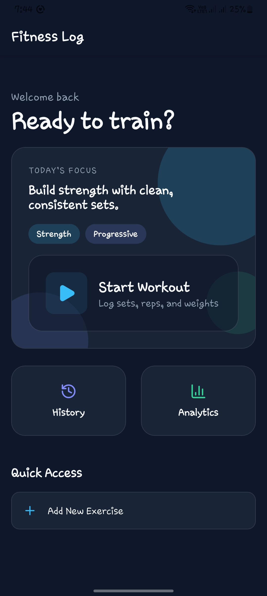
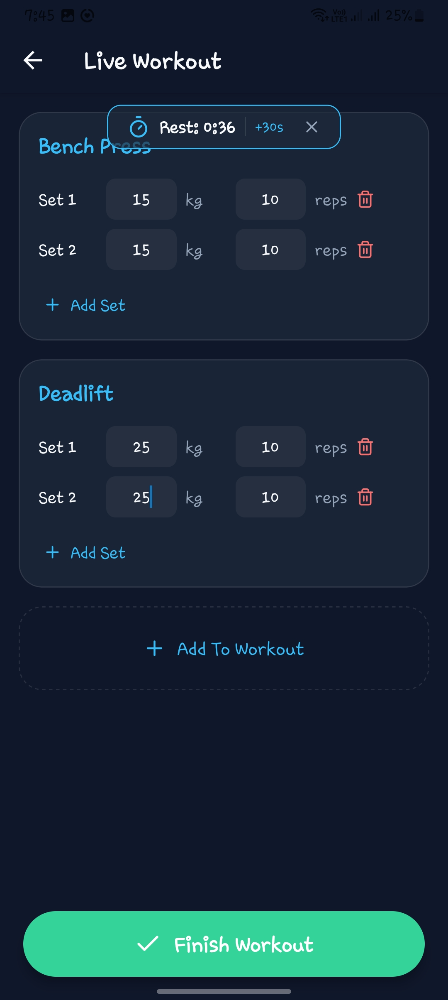
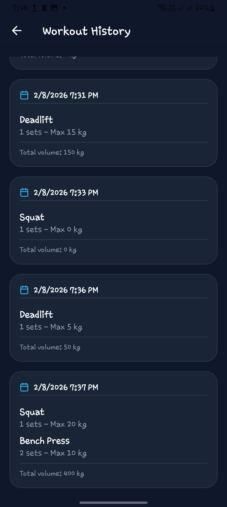
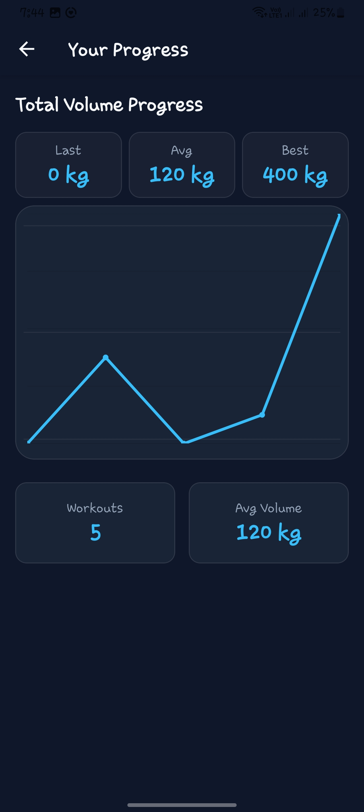

# Fitness Log

Modern workout tracker built with React Native (Expo) and a GraphQL backend backed by SQLite. Log sessions, track history, and visualize progress in a sleek, dark UI.

## Screenshots





## Features
- **Workout Logger**: Create sessions, add sets, reps, and weights.
- **Exercise Manager**: Add, edit, and delete exercises.
- **Rest Timer**: Quick rest timer during workouts.
- **History**: Review past workouts with volume summaries.
- **Analytics**: Clean progress chart with quick stats.

## Tech Stack
- **Mobile**: React Native (Expo), React Navigation, Apollo Client
- **Backend**: Node.js, Apollo Server, SQLite (`better-sqlite3`)
- **Charts**: Victory Native
- **UI**: RN StyleSheet + custom theme tokens

## Getting Started

### 1) Backend
```bash
cd server
npm install
node index.js
```
Server runs at `http://localhost:4000` by default.

### 2) Mobile App
```bash
cd mobile
npm install
npx expo start
```

## Physical Device Setup
If you’re running on a physical phone, update the API URL in:
`mobile/src/config.js`

```js
export const API_URL = 'http://YOUR_LAN_IP:4000';
```

## Project Structure
- `server` — GraphQL API + SQLite persistence
- `mobile` — Expo app
  - `src/api` — Apollo Client config
  - `src/screens` — Home, Workout, History, Analytics
  - `src/components` — RestTimer, UI building blocks
  - `src/theme` — design tokens
- `images` — README screenshots

## Notes
- The SQLite database is created at `server/fitness.sqlite`.
- If charts or API calls fail on device, confirm the phone and computer are on the same Wi‑Fi network.
